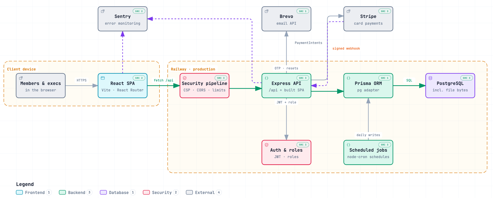

<div align="center">


# AUSS Member Platform

**Membership, events and check-in for the Auckland University Strength Society.**

[Live site](https://auss-backend-production.up.railway.app/) ·
[Runbook](RUNBOOK.md) ·
[Report a bug](https://github.com/ProjectAuss2026/Myauss/issues)

[](https://github.com/ProjectAuss2026/Myauss/actions/workflows/ci.yml)
[](https://github.com/ProjectAuss2026/Myauss/actions/workflows/codeql.yml)
[](https://github.com/ProjectAuss2026/Myauss/actions/workflows/security.yml)
[](LICENSE)


</div>

---

## Contents

- [Features](#features)
- [Architecture](#architecture)
- [Getting started](#getting-started)
- [Scripts](#scripts)
- [Testing](#testing)
- [Project structure](#project-structure)
- [Contributing](#contributing)
- [Deployment](#deployment)
- [Privacy and retention](#privacy-and-retention)
- [Contributors](#contributors)
- [License](#license)

## Features

**For members**
- Sign up with email verification (one-time code), and reset a forgotten password
- Pay for membership by card through Stripe, or by cash or bank transfer with an uploaded proof of payment that an admin reviews
- A member dashboard with members-only content and a personal QR pass for event entry
- Browse activities and RSVP, with capacity limits
- Order club merch

**For execs**
- Event check-in scanner: scan a member's QR pass at the door. The attendee list is pre-loaded, so it gives a verdict even without signal
- An admin dashboard for members and payment-proof review, activities, merch orders, execs and teams, sponsors, FAQ, the photo drive, and admin access and roles

**Public site**
- Home, About, Meet the Execs, Sponsorship, Social links, Media gallery and Privacy pages

**Behind the scenes**
- Membership lifecycle jobs: memberships lapse after a semester, and inactive accounts are warned, then removed
- Roles: `USER`, `ADMIN` and `OWNER`. Membership status moves `INACTIVE` → `IN_REVIEW` → `VERIFIED`
- Security headers and CSP (Helmet), request validation (Zod), rate limiting, structured logging (Pino) and error monitoring (Sentry)

## Architecture

In production, one Express service serves both the built React app and the `/api` routes.

<picture>
  <source media="(prefers-color-scheme: dark)" srcset="docs/architecture/runtime.architecture.dark.png" />
  
</picture>

An interactive version is in [`docs/architecture`](docs/architecture/README.md). It links every component to the exact source lines it was drawn from.

In development, Vite serves the frontend on port 5174 and proxies `/api` to the backend on port 3001.

## Getting started

### Prerequisites

- [Node.js](https://nodejs.org/) 24, which is what CI uses
- [Docker](https://www.docker.com/) with Docker Compose, for the local PostgreSQL database

### Setup

```bash
# 1. Clone and install. The repo is an npm workspace, so this installs backend and frontend.
git clone https://github.com/ProjectAuss2026/Myauss.git
cd Myauss
npm install

# 2. Configure the environment
cp .env.example .env

# 3. Start PostgreSQL (runs on localhost:5433)
npm run docker:up

# 4. Create the database schema and seed it
cd backend
npx prisma migrate dev
npm run prisma:seed
cd ..
```

The defaults in `.env.example` are enough to start the app. A few values matter as soon as you use it:

| Variable | Why it matters |
|---|---|
| `DATABASE_URL` | The default already matches `docker-compose.yml` |
| `JWT_SECRET` | Must be at least 32 characters, or the backend refuses to start |
| `STUDENT_ID_PEPPER`, `QR_PASS_SECRET` | Hash student IDs and sign member QR passes. Use long random values |
| `SMTP_*` or `BREVO_API_KEY` + `BREVO_SENDER_EMAIL` | Needed to receive sign-up codes locally. Codes are never logged, so without email you can't verify an account |
| `STRIPE_SECRET_KEY`, `VITE_STRIPE_PUBLISHABLE_KEY`, `STRIPE_WEBHOOK_SECRET` | Stripe **test** keys, for card payments |
| `OWNER_BOOTSTRAP_EMAIL`, `OWNER_BOOTSTRAP_PASSWORD` | Optional. The seed creates a first `OWNER` account from these |

See [`.env.example`](.env.example) for every option, each with a comment.

### Run

```bash
npm run server   # backend  → http://localhost:3001
npm start        # frontend → http://localhost:5174 (in a second terminal)
```

If you run the backend on another port, set `VITE_BACKEND_PORT` so the Vite proxy follows it. Stop the database with `npm run docker:down`.

## Scripts

| Where | Command | What it does |
|---|---|---|
| root | `npm run server` / `npm start` | Start the backend / frontend dev servers |
| root | `npm run build` | Backend checks, then the production frontend build |
| root | `npm run docker:up` / `docker:down` | Start / stop the local database |
| root | `npm run audit:ci` | The npm audit gate CI runs (high and critical) |
| backend | `npm run prisma:studio` | Browse the database in Prisma Studio |
| backend | `npm run prisma:seed` | Seed the database |
| backend | `npm test` | Backend test suite (`node --test`) |
| frontend | `npm test` | Frontend unit and UI tests (Node test runner and Vitest) |
| frontend | `npm run typecheck` | TypeScript check |
| frontend | `npm run preview` | Serve the production build locally |

Run workspace scripts with `--workspace=backend` or `--workspace=frontend` from the root, or from inside that folder.

## Testing

```bash
# Backend. The tests mock Prisma, so any well-formed DATABASE_URL works for generating the client.
cd backend
DATABASE_URL="postgresql://u:p@localhost:5432/db" npx prisma generate
npm test

# Frontend
cd ../frontend
npm test
npm run typecheck
```

Every pull request runs **Backend checks**, **Frontend checks**, **npm audit**, a **gitleaks** secret scan and **CodeQL**. All five must pass before merging.

## Project structure

```text
Myauss/
├── backend/               Express API
│   ├── prisma/            schema, migrations, seed
│   ├── scripts/           build-time checks (logging, syntax)
│   └── src/
│       ├── routes/        route definitions
│       ├── controllers/   request handlers
│       ├── middleware/    auth, validation, security, rate limiting
│       ├── schemas/       Zod request schemas
│       ├── services/      business logic
│       ├── jobs/          scheduled membership and clean-up jobs
│       ├── security/      route security tests and public-route list
│       └── utils/
├── frontend/              React + Vite app
│   ├── public/            logo, photos, sponsor logos, hero videos
│   └── src/app/
│       ├── pages/
│       ├── components/
│       ├── contexts/
│       └── lib/
├── shared/                code used by both sides (security headers, CSP)
├── scripts/               repo tooling (npm audit gate)
├── .github/workflows/     CI, CodeQL, Security
├── docker-compose.yml     local PostgreSQL
└── RUNBOOK.md             deploy, rollback, secrets, backups, monitoring
```

## Contributing

1. Branch off **`dev`**. Never open a pull request against `main` directly.
2. Open your pull request into `dev`. It needs **one approving review** and all CI checks passing, and the branch must be up to date with `dev`.
3. Changes reach production through a **release pull request** from `dev` into `main`.

Set up the pre-commit secret scan once:

```bash
pip install pre-commit && pre-commit install
```

## Deployment

Production runs on [Railway](https://railway.com/) as one service that deploys from `main`:

- **Build:** installs dependencies, builds the frontend and generates the Prisma client.
- **Start:** runs `prisma migrate deploy`, then starts the backend. The backend also serves the built frontend.

Deploys, rollback, secret rotation, backups and monitoring are covered in the [Runbook](RUNBOOK.md).

## Privacy and retention

- Student membership registration stores student IDs as protected backend data rather than displaying them publicly.
- Cash / Bank Transfer payment proof files are sensitive PII and their uploaded bytes are stored in PostgreSQL, never under the public `/uploads` static path or other repo-local upload folders.
- Payment proof metadata and file downloads are restricted to authorised `ADMIN` or `OWNER` users.
- Temporary staged payment proof uploads expire automatically and are cleaned up if they are never linked to a submitted registration.
- Retention and deletion of linked payment proof files should stay aligned with the existing privacy/retention work tracked in backend comments and cleanup jobs.

## Contributors

<table>
  <tr>
    <td align="center"><a href="https://github.com/aolin12138"><br /><sub><b>Aolin Yang</b></sub></a></td>
    <td align="center"><a href="https://github.com/desm2323"><br /><sub><b>Desmond Li</b></sub></a></td>
    <td align="center"><a href="https://github.com/Bigmonterss"><br /><sub><b>Jayden Pham</b></sub></a></td>
    <td align="center"><a href="https://github.com/ZingZing001"><br /><sub><b>Johnson Zhang</b></sub></a></td>
    <td align="center"><a href="https://github.com/kwan244"><br /><sub><b>Kevin</b></sub></a></td>
  </tr>
</table>

Built for the Auckland University Strength Society by ProjectAuss2026.

## License

[MIT](LICENSE) © 2025 ProjectAuss2026
